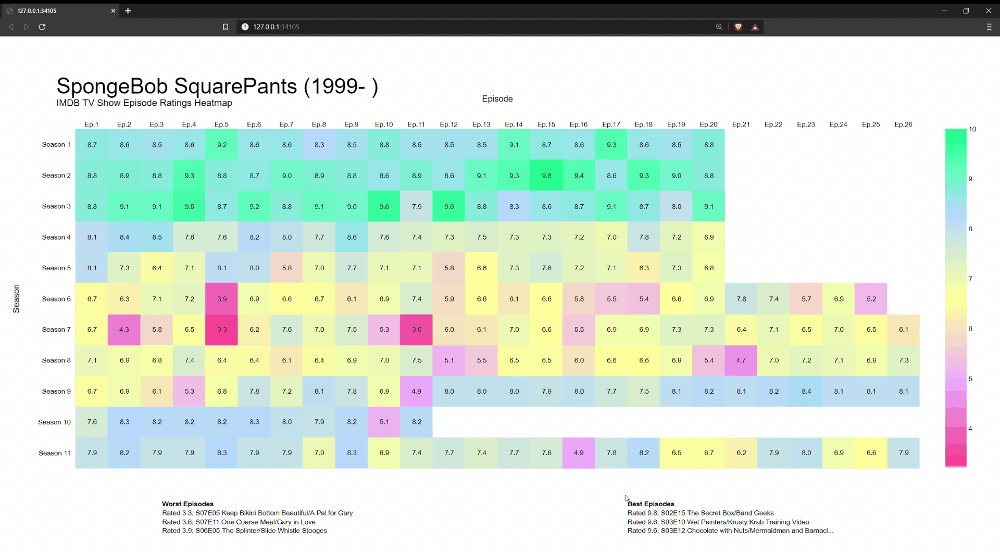
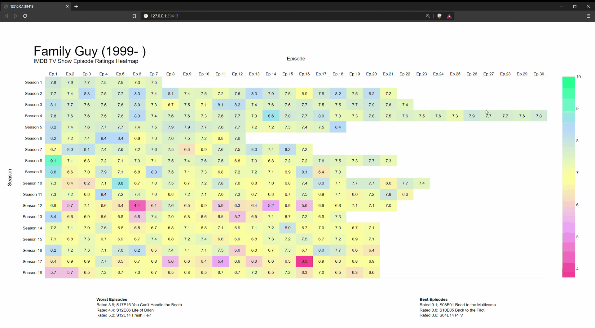

<h1>IMDB TV Show Heatmap</h1>
<h2>General</h2>
<h6>

Takes in a IMDB URL like this one: https://www.imdb.com/title/tt0206512/?ref_=fn_al_tt_1 and outputs a plotly heatmap in your default browser
</h6>

<h2>How it Works</h2>
<h6>

You give the URL, the `requests` package sends the the request and gets the document. `BeautifulSoup` parses the document, and filters through the content for the desired data. `pandas` keeps the data organized. `plotly` visualizes the data into a interactive heatmap.
</h6>

<h2>Examples of Interactive Heatmaps</h2>

